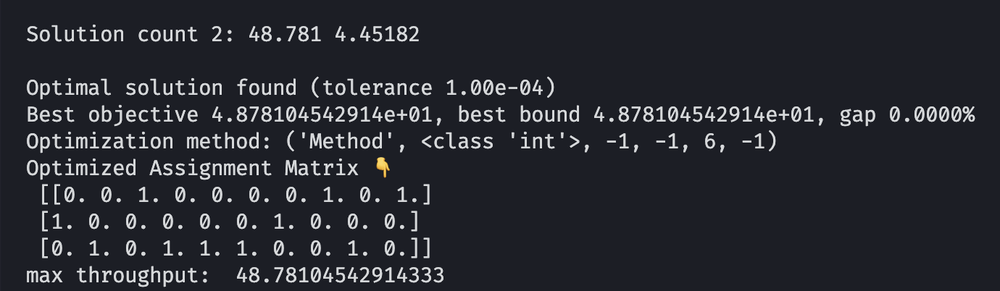
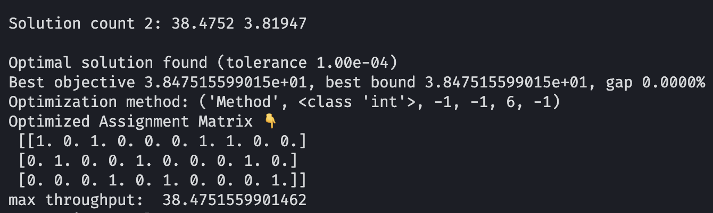
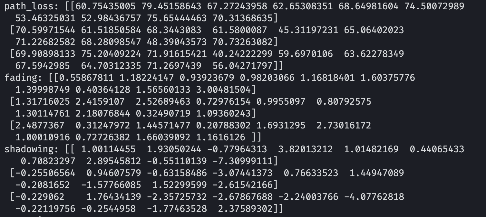
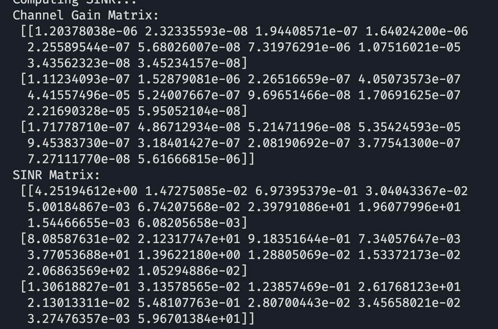
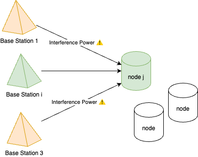
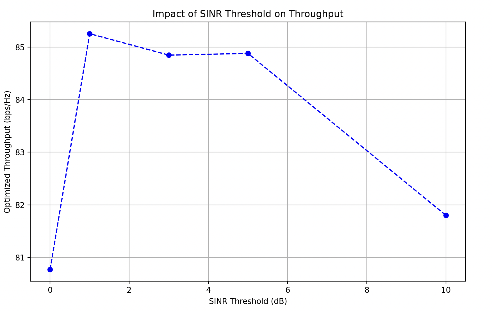

# Assignment1 - Report

## Result

| mobility_data_t0.csv                                         | mobility_data_t1.csv                                         |
| ------------------------------------------------------------ | ------------------------------------------------------------ |
|  |  |

## 1. How base station and mobility data are loaded

1. Read CSV files

   Use the `read_csv` method from the pandas package to read the given files: `base_stations.csv`, `mobility_data_t0.csv`, and `mobility_data_t1.csv`, in which there are [x, y] positions of base stations and mobile nodes.

   ```python
   df = pd.read_csv(file_path)
   ```

   - Base Stations: The csv file <u>is already in the form of [x, y]</u>, so we can load it directly.

     ```python
     bs_positions = load_base_stations(os.path.join(DATASET_PATH, "base_stations.csv"))
     ```

   - Mobile Nodes: <u>Only load [x, y]</u> as positions

     ```python
     mn_positions = mobility_data[['x', 'y']].values
     ```

2. Load mobile nodes files as an array

   There are 2 mobile nodes files in total, so we need to sort them first and process them separately.

   ```python
    mobility_files = sorted([f for f in os.listdir(
           DATASET_PATH) if f.startswith("mobility_data_t") and f.endswith(".csv")])
   
   for file in mobility_files:
     xxx
     xxx
   ```

## 2. How the channel gain is computed

> `Channel gain` measures the strength of the <u>received signal</u> relative to the strength of the <u>original transmitted signal</u>.

### Step1: Initiate channel gain matrix

|                | Mobile Node 1 | Mobile Node 2 | ... | Mobile Node 9 | Mobile Node 10 |
| -------------- | ------------- | ------------- | --- | ------------- | -------------- |
| Base Station 1 | 0             | 0             | ... | 0             | 0              |
| Base Station 2 | 0             | 0             | ... | 0             | 0              |
| Base Station 3 | 0             | 0             | ... | 0             | 0              |

### Step2: Calculate channel gain

There are 3 factors affecting channel gain：`path loss`, `Fading`, `Shadowing`.

- `Path loss`: Related to **distance** and **frequency**

  According to the relationship given in the lecture slides: $Path Loss∝(f⋅d)2$

  Here we only consider distance.

  ```python
  path_loss = 10 * np . log10(distances ** 4 + 1e-9)
  # in the decibel form
  ```

- `Fading`：This happens because the signal takes multiple paths (like reflecting and bending), causing its strength to change randomly.

  - Common types of fading include **Rayleigh fading** and **Rician fading**。

    - **Rayleigh fading**：Used when there is no clear line-of-sight path, such as in urban environments with multipath effects. (This assignment uses this method.)

      ```python
      fading = 10 * np.log10(np.random.rayleigh(scale=1.0, size=(total_bs, total_mn)))
      # scale=1.0 means the generated fading values follow a standard Rayleigh distribution, where the expected value of the signal fading intensity is 1.
      ```

    - **Rician fading**：Used in environments with a clear line-of-sight path along with multiple scattered paths.

- `Shadowing`：This is due to signal attenuation caused by large obstacles such as buildings and hills.

  - **Log-normal shadowing** is usually used to model shadow fading, assuming the signal attenuation follows a log-normal distribution.

    ```python
     shadowing = np.random.normal(loc=0, scale=2, size=(total_bs, total_mn))
    # loc=0.0 means the mean of the normal distribution is 0.
    # scale=2.0 means the standard deviation of the normal distribution is 2.
    ```

 Eventually computing "Channel Gain" is based on

$$
ChannelGain=−PathLoss+Fading+Shadowing
$$

But here we can transfer channel gain into linear form so that it would be convenient to compute SINR in the following steps

```python
# Linear form
channel_gains = 10**((-path_loss + shadowing + fading) / 10)
```

### ❓ Why [ ChannelGain = −PathLoss + Fading + Shadowing]

- `-`Path Loss: Essentially, this is the loss of signal power, which has to be `negative`.
- `+` Fading: Essentially, this is signal `fluctuation`, which can be either `positive or negative.` Fading occurs because signals travel through multiple paths, and the signals from each path can add up, causing transient power variations. This involves wave interference principles:
  - **Constructive Interference** (in-phase addition): Signal amplitude increases → **Positive gain**
  - \*Destructive Interference** (out-of-phase addition): Signal amplitude decreases → **Negative gain\*\*
- `+` Shadowing: Essentially, this is large-scale signal `fluctuation`, which can also be either `positive or negative`. It occurs due to large obstacles (like buildings or hills) blocking signal propagation, leading to slow variations in received power:
  - **Negative value:** Signal strength decreases, such as when signals pass through buildings, walls, or hills, causing obstruction or scattering.
    - 📉**Power loss:** Shadowing < 0
  - **Positive value:** Signal strength increases, such as when signals pass through gaps between buildings or get locally amplified due to reflection and focusing effects.
    - 📈**Power gain:** Shadowing > 0

### Generated Channel Gain Matrix

| Path loss / fading / shadowing   | Channel Gain / SINR      |
| -------------------------------- | ------------------------ |
|  |  |

## 3. How the SINR is computed for each BS-MN pair

### Step1: Initiate SINR matrix

|                | Mobile Node 1 | Mobile Node 2 | ... | Mobile Node 9 | Mobile Node 10 |
| -------------- | ------------- | ------------- | --- | ------------- | -------------- |
| Base Station 1 | 0             | 0             | ... | 0             | 0              |
| Base Station 2 | 0             | 0             | ... | 0             | 0              |
| Base Station 3 | 0             | 0             | ... | 0             | 0              |

### Step2: Calculate SINR

1. #### Calculate signal power for each <u>BS & MN</u>

   For every base station `i` to mobile node `j` : $Signal Power = (𝑃_{𝐵𝑆} ∗ 𝐺_{i𝑗})$

   ```python
   signal_power = power_bs * channel_gain[i, j]
   ```

2. #### Calculate interference power for each <u>MN</u>

   > 📌 The interference power at MN `j` is the sum of the contributions from **all base stations `k` that are not the current base station `i`.**

   

$$
𝐼_{𝑖𝑗} = ∑𝑘≠𝑖\,𝑃_{𝐵𝑆} ⋅ 𝐺_{𝑘j}
$$

   In the code format, it should be:

   ```python
   interference_power = np.sum([power_bs * channel_gain[k, j] for k in range(total_bs) if k != i])
   ```

3. #### Calculate SINR for each MN-BS pair

   For each BS `i` and MN `j`, the function to calculate SINR is

$$
𝑆𝐼𝑁𝑅_{𝑖𝑗} = (𝑃_{𝐵𝑆} ∗ 𝐺_{𝑖𝑗}) /(𝑁_0 + 𝐼{𝑖𝑗})
$$

   ```python
   sinr[i, j] = signal_power /(noise_power + interference_power)

   # ⚠️ We also need to  prevent the value of `sinr[i][j]` from becoming too small.
   sinr[i][j] = np.maximum(sinr[i][j], 1e-6)
   ```

## 4. Your optimization approach, which type of solution Gurobi provides?

We can check the algorithm used by Gurobi with the following code

```python
print("Optimization method:", model.getParamInfo("Method"))
#output👇
# Optimization method: ('Method', <class 'int'>, -1, -1, 6, -1)
```

Gurobi is using **Method 6 (Sifting)**, which is typically useful for large models with many constraints.

I haven’t explicitly set the `Method`, so Gurobi is using `-1` (Automatic). It will choose the most suitable algorithm depending on the structure of the problem.

**Sifting** is a specialized algorithm for solving **sparse** linear or mixed-integer programming (MILP) problems. It’s a variant of the simplex method but optimized for:

- **Sparse constraint matrices** (many zero entries)
- **More constraints than variables**
- **Simple constraint structures**, like assignment problems in this situation.

## 5. How the throughput changes with different SINR constraints?

Among the 3 constraints: `Assignment`, `SINR_MIN`, and `Binary`, the primary factor that has a critical impact is the SINR threshold. As a result, this problem can transform into:

> 📌 The impact of `SINR_MIN` on throughput. 📌

In the base code，_Minimum SINR threshold_ is 5. So here I set an array to let SINR_MIN change among [0, 1, 3, 5, 10]

```python
SINR_MIN_VALUES = [0, 1, 3, 5, 10]
```



- **Low SINR Threshold (0–1 dB): ** High throughput, but many users with low SINR connections contribute little to capacity, and <u>interference is high.</u>
- **Moderate SINR Threshold (3–5 dB)** Dropping low-quality connections reduces interference, letting stronger connections achieve higher data rates.
- **High SINR Threshold (10 dB)** <u>A high SINR threshold excludes many users</u> who can't meet the requirement, reducing the total number of connected users.

## 6. Any challenges encountered?

1. #### Mixing dB and Linear Values

   Initially, the calculations didn’t standardize the data to either linear or decibel form, causing **calculation errors due to mixing values in different scales**.

   The final adjustment was to represent **path loss**, **fading**, and **shadowing** all in <u>decibel form</u>, calculate the **channel gain in dB**, and then **convert the channel gain to linear form** to compute the SINR.

2. #### Most Values in the SINR Matrix Are Below the Given Threshold

   As a result, Gurobi determines that the model is **infeasible**, since many mobile nodes cannot meet the minimum SINR requirement for successful assignment.

   `Big-M Method`: Use a large number M to deactivate constraints based on binary decision variables.

   ```python
   M = float(np.max(sinr))
   for i in range(total_bs):
        for j in range(total_mn):
            # if sinr is above the threshold
            if sinr[i, j] >= SINR_MIN:
              # Use M to turn off the constraint
              model.addConstr(sinr[i,j] + M * (1-a[i,j]) >= SINR_MIN,
                               name=f"SINR_constraint_{i}_{j}")
   ```

When `a[i, j] = 0` (MN is NOT assigned to BS), the equation becomes: $sinr[i, j] + M \times (1 - 0) \geq SINR\_MIN$

Since `M` is very large, this inequality is **always true**, so the constraint is effectively **disabled**.

## 7. How to scale up the simulation

1. #### Increase Network Size

   1. **More Base Stations (BSs):** Add more BSs with varying power levels
   2. **More Mobile Nodes (MNs):** Simulate thousands or even millions of mobile nodes to test large-scale networks.

2. #### More Realistic Mobility Models

   Use more complex mobility models, like:

   1. **Random Waypoint**
   2. **Gauss-Markov Mobility**
   3. **Manhattan Grid Model** (for urban environments)

3. #### ML-Based Decision Making

   - Train an **ML model** to predict optimal BS-MN assignments based on SINR, mobility, and interference patterns.
   - Use **Reinforcement Learning** to dynamically adjust power control or handoff strategies.
